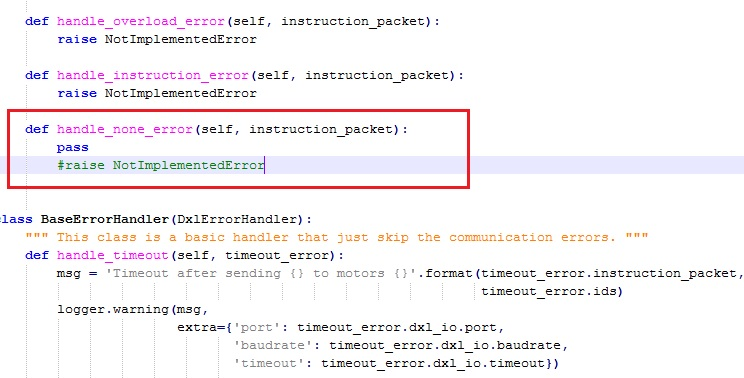

# Error in voltage

The voltage for the XL-320 is configured at 7.4V in pypot, if the source power has more voltage, pypot detect:

  **NotImplementedError**

The dynamixel XL-320 supports up to 8 volts, so we can modify the library to correct this error, because when this 
error appears, the motors stop working.

we need to find the file error.py, usually found in:

 *C:\Python27\Lib\site-packages\pypot\dynamixel\error.py*
 
Then we comment the line 52, and we add the sentence "pass", like the image below:

With this modification we can control the motors without any inconvenience

## [Home »] (https://github.com/joelortizsosa/Poppy_Right_Arm_Creature/blob/master/doc/README.md)
