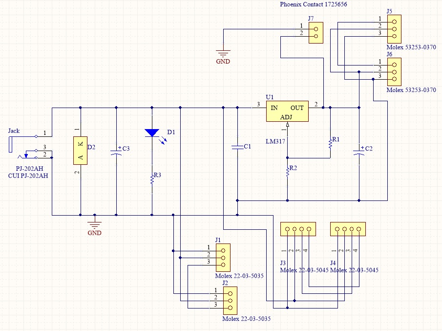

# About the Electronic

A small bit of electronic hacking is required for now. You need to power the XL-320 motors with 7.5V and the MX-28 with 12V.

The cables between motors have two purposes:

* Distribute alimentation to each motor
* Convey messages to each motor (ordering them to move or asking them for sensors values)

Thus the alimentation should be added between the USB2AX (that deals with communication aspects) and the motors.
To this end simply create the following card that can power both type of motors.

## Bill of Materials

| Description                   | Designator | Quantity |
| -----------------------------:|:----------:|:--------:|
| CAP CER 0.1UF 50V RADIAL      |    C1      |     1    |          
| CAP ALUM 1.0UF 50V RADIAL     |    C2      |     1    |
| Cap Aluminum Lytic 1000uF 25V |    C3      |     1    |
| Standard LED                  |    D1      |     1    |
| 1N5822                        |    D2      |     1    |
| Molex 22-03-5035              |   J1,J2    |     2    |
| Molex 22-03-5045              |   J3,J4    |     2    |
| Molex 53253-0370              |   J5,J6    |     2    | 
| CONN 2POS 1725656             |    J7      |     1    |
| CONN PWR JACK  PJ-202AH       |   JACK     |     1    |
| Resistors 200Ohm 1/4W         |    R1      |     1    |
| Resistors 1KOhm 1/4W          |    R2      |     1    |
| Resistors 430Ohm  1/4W        |    R3      |     1    |
| Adjuste Regulator LM317       |    U1      |     1    |
| [H/SINK 6396B](http://www.anglia-live.com/products/kw/6396b/506695001_h-sink-to220-to218-25mm-56c-w)| TO-220 radiator |   1  |
The card design has been made in CircuitMaker, you can open the project in:

[https://workspace.circuitmaker.com/Account/Login?ReturnUrl=%2fProjects%2f5513C8C5-B3C1-4E83-8C02-FD9805562557] (https://workspace.circuitmaker.com/Account/Login?ReturnUrl=%2fProjects%2f5513C8C5-B3C1-4E83-8C02-FD9805562557)

But you need an account, you can create an account in this [link](http://www.circuitmaker.com/thank-you/#download), then you have access to project.

If you have your own PCB designer for make circuits, you can follow this schematic:

## [Software »]( https://github.com/joelortizsosa/Poppy_Right_Arm_Creature/blob/master/doc/software.md)

