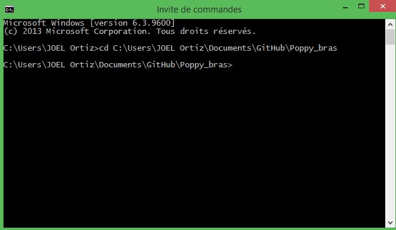
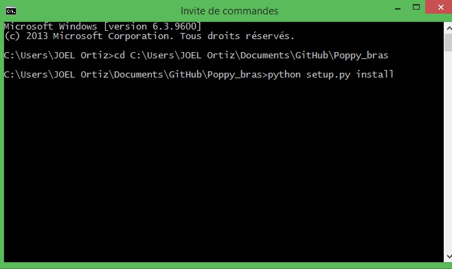
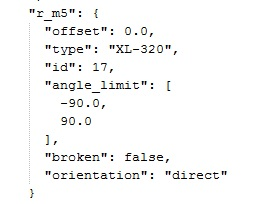
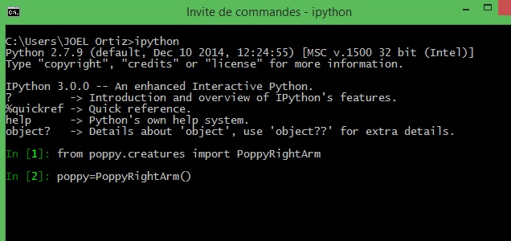
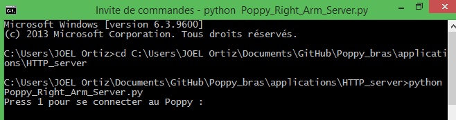
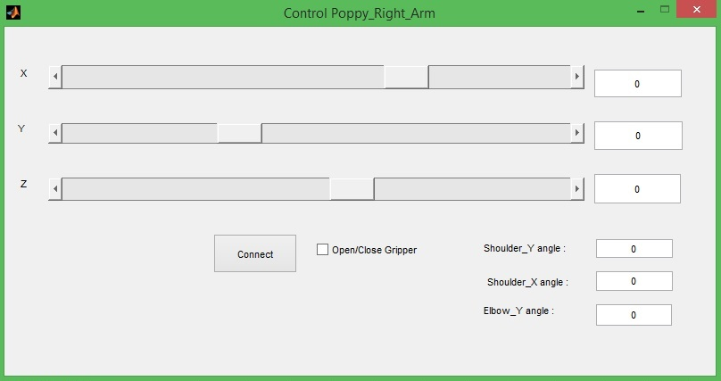

# About the Software

## Install Creature

you can donwload the creature in this [link](https://github.com/joelortizsosa/Poppy_bras_Creatures/archive/master.zip).To make the installation (in windows xp,7,8), It's necessary load  the command-line interpreter on Windows and then 
you need to be located in the folder of the creature:

Then you can install the library as follows

*If you dont have python and the software necessay already installed, you can follow these [instructions](https://forum.poppy-project.org/t/poppy-on-windows-all-you-need-to-do/392)*

## Configuration of *.JSON

As the gripper of the arm can be configured to add different degrees of freedom, it is necessary to disable / enable the motors to be used. To do this you need to modify the configuration file, located at:

*C:\Python27\Lib\site-packages\poppy_right_arm-1.0.0-py2.7.egg\poppy_right_arm\configuration\poppy_right_arm.json*

Then you can open this file with the Notepad

* if you write "True", the motor will be disabled.

* if you write "False", the motor will be enabled.

> *Note: change the file. * json in Poppy_Right_Arm not cause bug in any others creatures*

Once these parameters are defined, now we can use the creature.

## Python Server

To control the Poppy_Right_Arm from another software such as Matlab, you must create a server in python that can handle all the motors remotely.

We can start an HTTP server permitting the remote access of  Poppy_Right_Arm creature. In this [link](https://github.com/poppy-project/pypot/blob/master/samples/notebooks/Accessing%20pypot%20REST%20API%20through%20HTTP%20requests.ipynb) you can find one explanation. Extra [information](https://github.com/poppy-project/pypot/blob/master/REST-APIs.md).

**Note: Poppy_Right_Arm creature use a software architecture style for building scalable web services (REST-API)*

we implemented a server, with the ideal setting to control the Poppy_Right_Arm. You can see the code in this [link] (https://github.com/joelortizsosa/Poppy_Right_Arm_Creature/blob/master/applications/HTTP_server/Poppy_Right_Arm_Server.py)
To execute the server it's necessary load  the command-line interpreter and to be located in the folder of the code, then you put this code:

**python Poppy_Right_Arm_Server.py**

*Note: if you have saved the code with another name, it is necessary to run with that name*

## Matlab Control

With the python server we can do different applications, for example we used matlab to calculate the inverse kinematics to control the arm, for do it, we use the calcule of this [link](https://forum.poppy-project.org/t/cinematique-inverse-bras-de-poppy/1306)

There are many software with [REST API](https://en.wikipedia.org/wiki/Representational_state_transfer) support, Matlab only support REST API from 2014 version, but we can use the HTTP protocol. The HTTP protocol implemented in Matlab is very basic, you can download an improved version in this [link](http://www.mathworks.com/matlabcentral/fileexchange/35693-urlread2)

We did a client in matlab that you can download from this [link](https://github.com/joelortizsosa/Poppy_Right_Arm_Creature/blob/master/applications/Matlab_client/Matlab_client.rar?raw=true). This client can control the Poppy_Right_Arm using the inverse kinematics, only you have to press the boton "Connect" and then move the sliders of each axe.

## [Home »] (https://github.com/joelortizsosa/Poppy_Right_Arm_Creature/blob/master/doc/README.md)

